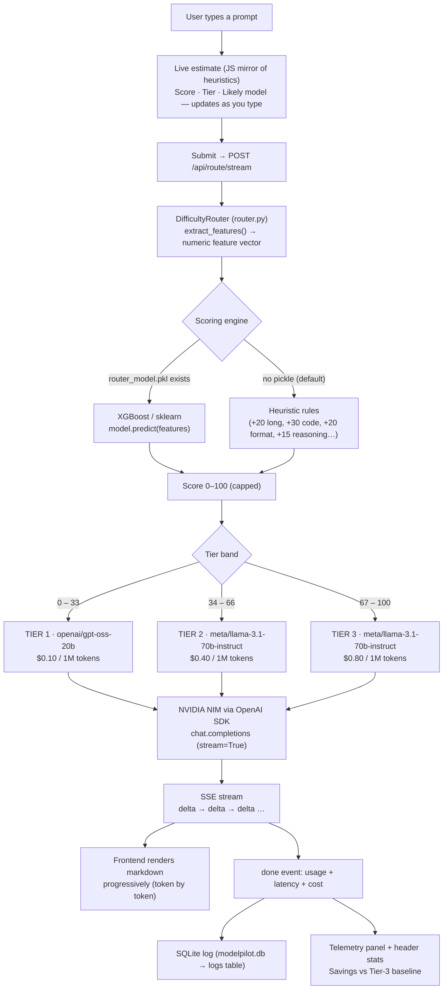

# ModelPilot

**A Cost-Aware Multi-Model AI Routing System**

**Live demo:** [modelpilot-production.up.railway.app](https://modelpilo-nv.up.railway.app)

ModelPilot scores every prompt for complexity in real time and routes it to the **cheapest capable model** hosted on NVIDIA NIM — so trivial questions don't burn premium tokens, and hard problems don't get weak answers. Every request is measured (latency, tokens, cost) and logged locally to SQLite.

---

## What It Does

| Without ModelPilot | With ModelPilot |
|---|---|
| Every prompt → one expensive model | Every prompt → the cheapest model that can handle it |
| Flat cost per request | 50–87% savings on simple traffic (Tier-1 vs Tier-3 pricing) |
| No visibility into spend | Live telemetry: score, model, latency, tokens, cost |

---

## How It Works



---

## Architecture

```
Browser (Vanilla JS) Backend (FastAPI) External
───────────────────── ────────────────── ────────
index.html / style.css / app.js ──▶ main.py (routes, SSE streaming)
 • Live difficulty estimate ├── router.py (scoring) ──▶ (optional)
 • SSE stream reader ├── nvidia_client.py (transport) ─▶ NVIDIA NIM
 • Markdown render (marked+ ├── database.py (SQLite) integrate.api.
 DOMPurify) └── config.py (API key) nvidia.com
 • Canvas aurora background
 • Telemetry & stats modelpilot.db (logs table)
```

### Project Structure

```
Model Pilot/
├── main.py # FastAPI app: /api/route, /api/route/stream, /api/logs, /api/stats
├── router.py # DifficultyRouter — feature extraction + heuristic scoring
├── nvidia_client.py # OpenAI SDK → NVIDIA NIM transport (blocking + streaming)
├── database.py # SQLite persistence (logs table, self-healing schema)
├── config.py # NVIDIA_API_KEY (env-var overridable) — never exposed to UI
├── requirements.txt # fastapi, uvicorn, openai, pydantic
├── modelpilot.db # created automatically on first run
└── static/
 ├── index.html
 ├── style.css
 └── app.js
```

---

## Tech Stack

| Layer | Technology |
|---|---|
| **Backend** | Python 3.10+, FastAPI, Pydantic v2, Uvicorn |
| **AI Transport** | OpenAI Python SDK → NVIDIA NIM (`https://integrate.api.nvidia.com/v1`) |
| **Routing Logic** | Pure-Python heuristics; `DifficultyRouter(model_path="…pkl")` accepts a trained XGBoost/sklearn estimator |
| **Database** | SQLite via `sqlite3` (thread-safe, self-healing schema) |
| **Frontend** | HTML5, CSS3, Vanilla JS, Canvas 2D animation |
| **Rendering** | marked.js + DOMPurify (sanitized, streamed markdown) |
| **Streaming** | Server-Sent Events (SSE), with non-streaming fallback |

---

## The Model Fleet

| Tier | Score Band | Model (NVIDIA NIM) | Price* | Best at |
|:---:|:---:|---|:---:|---|
| **T1** | 0 – 33 | `openai/gpt-oss-20b` | $0.10 / 1M tok | Quick facts, drafts, lookups |
| **T2** | 34 – 66 | `meta/llama-3.1-70b-instruct` | $0.40 / 1M tok | Code helpers, JSON output, summaries |
| **T3** | 67 – 100 | `meta/llama-3.1-70b-instruct` | $0.80 / 1M tok | Debugging, trade-off analysis, deep reasoning |

\* Dummy prices for dashboard calculations.

> **Note:** Tiers 2 and 3 currently share the same underlying model. Tier 3 works as the high-difficulty price band — swap its `model_id` in `router.py → MODEL_REGISTRY` when you want a stronger model there; nothing else needs to change.

### Scoring Rules (Heuristic v1)

| Signal | Example trigger | Points |
|---|---|:---:|
| Extended context | prompt > 500 words | +20 |
| Medium context | prompt > 200 words | +10 |
| Code content | `def`, `python`, `sql`, stack traces… | +30 |
| Fenced code block | explicit ``` block | +8 |
| Format constraints | "JSON", "table", "schema", "markdown"… | +20 |
| Complex reasoning | "explain why", "analyze", "compare"… | +15 |
| Deep multi-cue reasoning | 3+ distinct reasoning signals | +8 |

Score is capped at **100**. Bands: `0–33 → T1`, `34–66 → T2`, `67–100 → T3`.

> **ML upgrade path:** `extract_features()` returns a stable numeric feature vector. Train any regressor on the same columns, pickle it, and pass the path to `DifficultyRouter` — no other code changes needed. If the pickle fails to load, the router falls back to heuristics automatically.

---

## API Reference

### `POST /api/route` — classic (blocking)
```jsonc
// request (api_key optional — falls back to config.py)
{ "prompt": "Write a Python function that validates emails", "api_key": null }

// response
{ "response": "…", "routing_score": 50, "model_selected": "meta/llama-3.1-70b-instruct",
 "tier": 2, "latency_ms": 51012.4, "tokens_in": 77, "tokens_out": 649, "cost_usd": 0.000029 }
```

### `POST /api/route/stream` — streaming (used by the UI)
```
data: {"type":"meta","routing_score":50,"tier":2,"model_selected":"…","model_name":"Llama 3.1 70B"}
data: {"type":"delta","text":"Here is the "}
data: {"type":"delta","text":"implementation…"}
data: {"type":"done","text":"…","latency_ms":…,"tokens_in":…,"tokens_out":…,"cost_usd":…}
data: {"type":"error","detail":"…"} // on failure
```

### Other endpoints
| Method | Path | Purpose |
|---|---|---|
| `GET` | `/api/logs?limit=20` | Last N logged requests (newest first) |
| `GET` | `/api/stats` | Totals: requests, tokens, spend, tier mix |
| `GET` | `/api/key-status` | Whether a server-side key is active (masked only) |

---

## Getting Started

```bash
# 1. Install dependencies
pip install -r requirements.txt

# 2. Add your NVIDIA API key (get one at https://build.nvidia.com)
export NVIDIA_API_KEY="nvapi-…"

# 3. Run the server
uvicorn main:app --reload

# 4. Open the app
# http://127.0.0.1:8000
```

The browser never sees the key — it's resolved server-side per request (request `api_key` field overrides `config.py`, and the `NVIDIA_API_KEY` env var overrides the file).

---

## UI Highlights

- **Live routing estimate** — as you type, a client-side mirror of the Python heuristics shows the score, fired signals, tier, and likely model before you submit.
- **Streaming response canvas** — tokens render progressively with sanitized markdown and syntax-aware code blocks; a stall-guard aborts quietly after 2 minutes of silence.
- **Telemetry** — routing score, model badge, latency, tokens, cost, and live "saved vs Tier-3-only" savings.

---

## Notes & Limitations

- **Keep `config.py` private** — it holds your NIM key in plaintext. Don't commit it (prefer the env var in production).
- Prices are **dummy values** for dashboard math, not real NIM billing.
- Llama 3.1 70B on NIM can take **~80 s even for tiny prompts** under load; the tier badge arrives instantly via the `meta` event while you wait.
- The SQLite `logs` table records every successful request; the history table was removed from the UI by design — data still accumulates in `modelpilot.db`.

---

*ModelPilot — every prompt routed to the cheapest capable model.*
